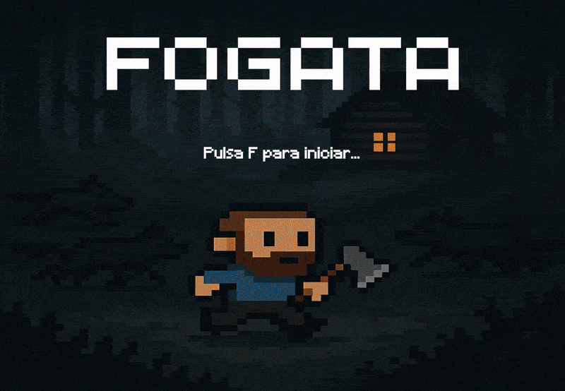
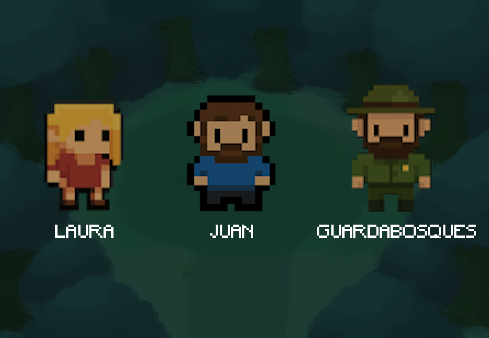

# Nombre del juego: Fogata

## Equipo de desarrollo

- Maldonado, Benjamin
- Jerochim, Maximiliano
- Mamani, Rocio Belen
- Sanchez, Matias Pablo Jesus

## Trailer

## Sinopsis

Fogata trata la historia de dos viajeros, Juan y Laura, que se embarcan en una aventura que tiene como lugar en el sur Argentino.
Sin embargo, una situación casual termina desembocando un sin fin de problemas que Juan debe resolver cuanto antes sea posible.

A lo largo de toda la trama surgen momentos inesperados que motivan la necesidad de una respuesta por parte de Juan, la cual es canalizada
en una venganza hacia una persona que nunca esperó que lo traicionase. 

## Reglas de Juego / Instrucciones

Controles:

-    w : Mover arriba.
-    a : Mover izquierda.
-    s : Mover abajo.
-    d : Mover derecha.
-    e : Dialogar con un NPC.
-    f : Saltar diapositiva.
-    k : Atacar.

## Personajes

## Otros

- Curso: Programacion con Objetos I.
- Facultad: Universidad Nacional de Quilmes.
- Versión de wollok: 0.3.1.
- Una vez terminado, no tenemos problemas en que el repositorio sea público / queremos manternerlo privado.
